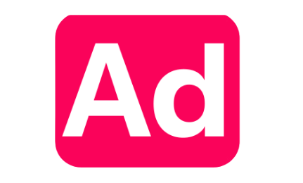

<a name="readme-top"></a>

<div align="center">

  
  <br/>

  <h3><b>Adomate</b></h3>

</div>

<!-- TABLE OF CONTENTS -->

# 📗 Table of Contents

- [📗 Table of Contents](#-table-of-contents)
- [📖 Adomate ](#-adomate-)
  - [🛠 Built With ](#-built-with-)
    - [Tech Stack ](#tech-stack-)
    - [Key Features ](#key-features-)
  - [🚀 Live Demo Live preview](#-live-demo-live-preview)
  - [💻 Getting Started ](#-getting-started-)
    - [Prerequisites](#prerequisites)
    - [Setup](#setup)
    - [Install](#install)
    - [Usage](#usage)
    - [Deployment](#deployment)
    - [Architecture](#architecture)
      - [Folder Structure](#folder-structure)
    - [Technology Choices and Trade-offs](#technology-choices-and-trade-offs)
      - [Bonus Features](#bonus-features)
      - [Known Limitations](#known-limitations)
  - [👥 Authors ](#-authors-)
  - [🔭 Future Features ](#-future-features-)
  - [🤝 Contributing ](#-contributing-)
  - [⭐️ Show your support ](#️-show-your-support-)
  - [🙏 Acknowledgments ](#-acknowledgments-)
  - [❓ FAQ ](#-faq-)
  - [📝 License ](#-license-)

<!-- PROJECT DESCRIPTION -->

# 📖 Adomate <a name="about-project"></a>

> Adomate is a web-based design tool that allows users to create and edit designs with a user-friendly interface. It includes features like a canvas editor, text tools, and image upload capabilities all within your browser.

**Adomate** is a design tool built for simplicity and efficiency.

## 🛠 Built With <a name="built-with"></a>

### Tech Stack <a name="tech-stack"></a>

<details>
  <summary>Client</summary>
  <ul>
    <li><a href="https://reactjs.org/">React.js</a></li>
    <li><a href="https://nextjs.org/">Next.js</a></li>
    <li><a href="https://redux.js.org/">Redux</a></li>
    <li><a href="https://github.com/rt2zz/redux-persist">redux-persist</a></li>
    <li><a href="https://redux-toolkit.js.org/">Redux Toolkit</a></li>
    <li><a href="https://github.com/omnidan/redux-undo">redux-undo</a></li>
    <li><a href="https://tanstack.com/">tanstack virtual</a></li>
    
  </ul>
</details>

<details>
  <summary>Styling</summary>
  <ul>
    <li><a href="https://tailwindcss.com/">Tailwind CSS</a></li>
    <li><a href="https://ui.shadcn.com/">shadcn/ui</a></li>
  </ul>
</details>

<!-- Features -->

### Key Features <a name="key-features"></a>

- **Canvas Editor for creating designs**
- **Text tools for customizing fonts and styles**
- **Image upload and manipulation**

<p align="right">(<a href="#readme-top">back to top</a>)</p>

<!-- LIVE DEMO -->

## 🚀 Live Demo <a name="live-demo" href="https://adomate-eosin.vercel.app/">Live preview</a>

<p align="right">(<a href="#readme-top">back to top</a>)</p>

<!-- GETTING STARTED -->

## 💻 Getting Started <a name="getting-started"></a>

> Follow these steps to set up and run the project locally.

### Prerequisites

In order to run this project you need:

- Node.js installed
- npm or yarn package manager

### Setup

Clone this repository to your desired folder:

```sh
  git clone https://github.com/ambrose-kibet/adomate.git
  cd adomate
```

Create a `.env` file in the root directory and add the following environment variable:

```properties
NEXT_PUBLIC_GOOGLE_FONTS_KEY=your_google_fonts_api_key
```

### Install

Install this project with:

```sh
  npm install
```

### Usage

To run the project, execute the following command:

```sh
  npm run dev
```

### Deployment

You can deploy this project using platforms like Vercel or Netlify.

### Architecture

Adomate follows a modular architecture, separating concerns into distinct components and utilities. The main structure includes:

#### Folder Structure

```
project-root/
├── app/ # Next.js application entry point
│   ├── layout.tsx # Application layout
│   ├── page.tsx # Main page
│   └── providers.tsx # Context providers
│
├── components/ # Reusable UI components
│   ├── navbar.tsx # Navigation bar
│   ├── sidebar.tsx # Sidebar menu
│   ├── theme-provider.tsx # Theme provider for switching light/dark modes
│   ├── ui/ # shadcn/ui components
│   └── tools/ # Design tools
│
├── lib/ # Utility functions and helpers
│   ├── utils.ts # Common utilities
│   └── redux/ # Redux-related utilities
│       ├── store.ts # Redux store configuration
│       └── fabric/ # fabric js State slices
│           ├── fabric-slice.ts # Fabric.js state slice
│           └── canvas-slice.ts # Canvas state slice
│       └── fonts/ # Font management slice
│           ├── fonts-slice.ts # Fonts state slice
│           └── font-utils.ts # Font-related utilities
│
├── public/ # Static assets
│   ├── images/ # Image files
│   └── shapes/ # SVG shapes assets
├── utils/ # Utility functions and helpers
│   └── font-loader.ts # Font loading utilities
```

### Technology Choices and Trade-offs

- **Redux Toolkit**: Chosen for its robust state management capabilities, Redux Toolkit streamlines the process of handling complex application state. Its built-in support for immutability, middleware, and developer tools makes it ideal for features like undo/redo and state persistence. The large ecosystem and active community ensure long-term reliability and access to best practices.
- **Tailwind CSS**: Tailwind’s utility-first approach allows rapid prototyping and consistent styling across the application. By minimizing custom CSS, it improves maintainability and scalability, while also enabling easy theme customization for light and dark modes.
- **shadcn/ui**: This component library provides a set of accessible, customizable, and well-designed UI elements. Leveraging shadcn/ui accelerates development, ensures visual consistency, and reduces the overhead of building common components from scratch.
- **redux-persist**: To enhance user experience, redux-persist is used for saving and restoring application state across sessions. This is especially important for a design tool, where users expect their work to be preserved even after closing the browser.
- **redux-undo**: Undo/redo functionality is essential in design applications. Redux-undo integrates seamlessly with Redux Toolkit, allowing users to revert changes easily. Its reliability and recommendation in Redux documentation make it the preferred choice for this feature.
- **TanStack Virtual**: Rendering large lists efficiently is critical, especially when dealing with over 1800 fonts. TanStack Virtual optimizes list rendering by only displaying visible items, resulting in smooth performance and reduced memory usage.

#### Bonus Features

- **Ability to edit line-height, letter-spacing, and layer duplication**
- **Ability to toggle between light and dark themes**

#### Known Limitations

- The application uses local storage for state persistence, which may not be suitable for all use cases. It has a size limit and may not handle large datasets efficiently. Future improvements could include server-side storage options for better scalability and reliability.
- There is limited support for shape and manipulation features.
<p align="right">(<a href="#readme-top">back to top</a>)</p>

<!-- AUTHORS -->

## 👥 Authors <a name="authors"></a>

👤 **Ambrose**

- GitHub: [@ambrose](https://github.com/ambrose-kibet)
- LinkedIn: [Ambrose](https://linkedin.com/in/ambrose-kibet)

<p align="right">(<a href="#readme-top">back to top</a>)</p>

<!-- FUTURE FEATURES -->

## 🔭 Future Features <a name="future-features"></a>

- [ ] **Advanced image editing tools**
- [ ] **Collaboration features**
- [ ] **Export designs in multiple formats**

<p align="right">(<a href="#readme-top">back to top</a>)</p>

<!-- CONTRIBUTING -->

## 🤝 Contributing <a name="contributing"></a>

Contributions, issues, and feature requests are welcome!

Feel free to check the [issues page](../../issues/).

<p align="right">(<a href="#readme-top">back to top</a>)</p>

<!-- SUPPORT -->

## ⭐️ Show your support <a name="support"></a>

If you like this project, please give it a ⭐️!

<p align="right">(<a href="#readme-top">back to top</a>)</p>

<!-- ACKNOWLEDGEMENTS -->

## 🙏 Acknowledgments <a name="acknowledgements"></a>

I would like to thank the open-source community for their amazing tools and resources.

<p align="right">(<a href="#readme-top">back to top</a>)</p>

<!-- FAQ (optional) -->

## ❓ FAQ <a name="faq"></a>

- **Can I use this project for commercial purposes?**

  - Yes, this project is MIT licensed.

<p align="right">(<a href="#readme-top">back to top</a>)</p>

<!-- LICENSE -->

## 📝 License <a name="license"></a>

This project is [MIT](./LICENSE) licensed.

<p align="right">(<a href="#readme-top">back to top</a>)</p>
